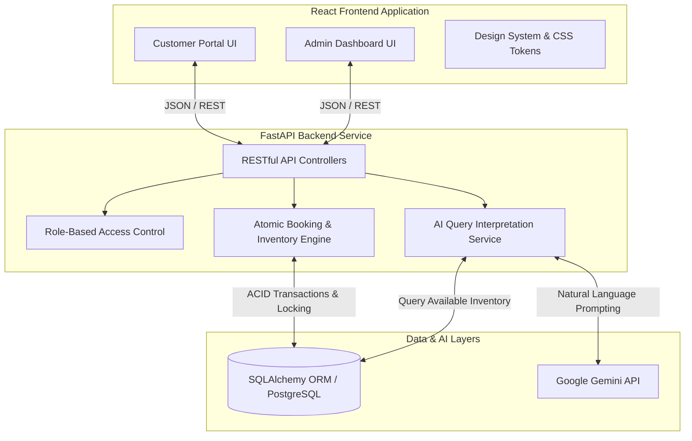
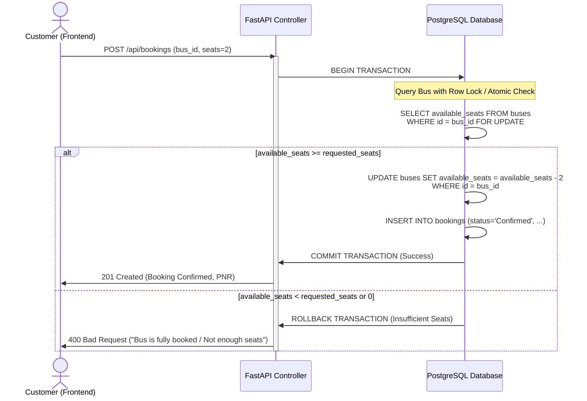
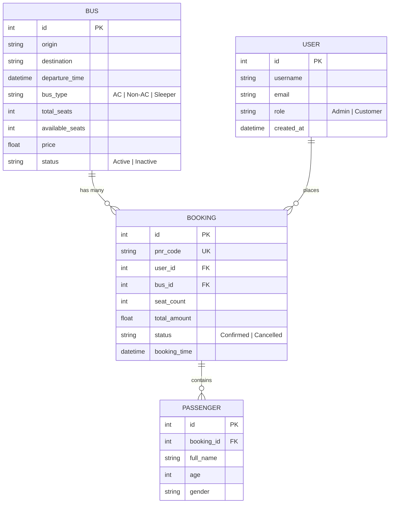

# AI-Powered Bus Ticketing System — Implementation Plan & Requirements Specification

This document outlines the comprehensive architectural, functional, and technical implementation plan for the **AI-Powered Bus Ticketing System**. The application features a robust **Python (FastAPI)** backend equipped with natural language processing capabilities and a modern, high-performance **React** frontend designed with rich aesthetics and seamless animations.

---

## 1. Executive Summary & System Architecture

The system serves two distinct user roles—**Customers** and **Admins**—through a unified web platform. Customers can discover travel options using natural language queries interpreted by AI, book seats with real-time inventory locking, and manage their reservations. Admins have comprehensive oversight over bus fleets, routes, schedules, and real-time business analytics.

---

## 2. Technology Stack Specification

| Layer | Technology | Rationale & Key Features |
| :--- | :--- | :--- |
| **Backend Framework** | **Python (FastAPI)** | High-performance asynchronous execution, native Pydantic data validation, automatic OpenAPI/Swagger documentation, and clean RESTful design. |
| **Database & ORM** | **SQLAlchemy 2.0 + PostgreSQL** | Production-grade RDBMS with full ACID compliance, `SELECT ... FOR UPDATE` row-level locking for atomic seat inventory, and robust concurrent transaction handling. |
| **AI / NLP Engine** | **Google Gemini API (`google-genai` SDK)** | Natural language entity extraction (Origin, Destination, Travel Date, Time Preference, Bus Type, Price) converting conversational prompts into structured search filters via Gemini's function-calling / structured output. |
| **Frontend Framework** | **React 18 (Vite + TypeScript/JS)** | Fast component-based rendering, modular architecture, separate routing for Admin/Customer workspaces. |
| **Styling & UI/UX** | **Vanilla CSS (Modern Design System)** | Premium custom design system using CSS variables, glassmorphism, vibrant gradients, dark/light themes, and interactive micro-animations. |
| **HTTP Client & State** | **Axios & React Context / TanStack Query** | Efficient server state management, caching, and optimistic UI updates during seat bookings. |

---

## 3. Comprehensive Feature Descriptions & Requirements

### 3.1. Customer Role Features

#### 1. Dual Search Engine (Standard & AI-Powered)
* **Standard Search**: Traditional form-based search filtering by Origin, Destination, Travel Date, and Bus Type (`AC`, `Non-AC`, `Sleeper`).
* **AI Natural Language Search**:
  * **User Experience**: A prominent, conversational search bar allowing queries like: *"I need a bus from Hyderabad to Bangalore tomorrow morning, preferably AC under ₹1500"*.
  * **Date-Aware AI Interpretation**: The backend injects the **server's current date/time** into the Gemini prompt as context, then parses the unstructured user query into structured parameters:
    * `origin`: "Hyderabad"
    * `destination`: "Bangalore"
    * `travel_date`: "2026-07-08" *(resolved from "tomorrow" against current server date `2026-07-07`)*
    * `time_preference`: "Morning" (mapped to departure time window e.g., 05:00 - 11:59)
    * `bus_type`: "AC"
    * `max_price`: 1500
  * **Date Resolution Rules**:
    * The system prompt to Gemini always includes: `"Today's date is {server_current_date}"`.
    * Relative expressions like *"tomorrow"*, *"this weekend"*, *"next Friday"*, *"day after tomorrow"* are resolved into absolute `YYYY-MM-DD` dates by the LLM.
    * If the user query contains **no date reference at all**, the system defaults `travel_date` to **today's date**.
    * If an explicit date is provided (e.g., *"on July 15"*), it is used directly.
  * **Relevance Ranking**: Results are dynamically scored and ranked based on exact route matches, date match, proximity to preferred departure time, seat availability, and price adherence.

#### 2. Bus Discovery & Real-Time Availability Display
* **Dynamic Cards**: Displays bus details including route, departure/arrival timestamps, travel duration, bus type badge, total vs. available seat count, and ticket pricing.
* **Urgency Indicators**: Visual cues when seat availability is low (e.g., *"Only 3 seats left!"*).

#### 3. Seamless Booking Flow & Passenger Capture
* **Seat Selection & Details**: Customer selects a bus, specifies the number of seats to book, and enters passenger details (Name, Age, Gender, Contact Information).
* **Booking Confirmation**: Generates a unique Booking Reference ID (`PNR`) with instant confirmation status.
* **Inventory Decrement**: Atomically reduces available seats on the bus upon successful reservation.

#### 4. Booking History & Lifecycle Management
* **My Bookings Portal**: Lists all active and past bookings categorized by status (`Confirmed`, `Cancelled`, `Completed`).
* **Instant Cancellation**: Allows customers to cancel a confirmed booking with a single click.
* **Seat Restoration**: Automatically releases booked seats back to active inventory upon cancellation.

---

### 3.2. Admin Role Features

#### 1. Fleet & Schedule Management (CRUD Operations)
* **Add New Buses**: Form to create buses specifying Origin, Destination, Departure Time, Bus Type (`AC`, `Non-AC`, `Sleeper`), Total Seats, and Base Price per seat.
* **Status Controls**: Toggle bus operational status (`Active`, `Maintenance`, `Cancelled`).
* **Live Inventory Monitoring**: View current occupancy and remaining seats in real time.

#### 2. Business Intelligence & Analytics Dashboard
* **Key Performance Indicators (KPIs)**:
  * **Today's Total Bookings**: Aggregate count of confirmed tickets for the current day.
  * **Total Revenue**: Cumulative earnings from confirmed bookings.
  * **Average Occupancy Rate (%)**: System-wide fleet utilization metric.
* **Visual Data Insights**:
  * **Occupancy Rate by Bus**: Comparative analysis highlighting high-performing vs. underutilized buses.
  * **Route-Wise Demand**: Heatmap/chart breakdown showing the most popular travel corridors (e.g., Hyderabad ➔ Bangalore vs. Mumbai ➔ Pune).

---

### 3.3. Core Engine: Overbooking Prevention & Concurrency

To ensure **zero overbooking** under concurrent customer access, the backend implements strict ACID transactional integrity:

* **Atomic Update Guard**: In SQL terms, updates are executed with a conditional check:
  `UPDATE buses SET available_seats = available_seats - :seats WHERE id = :bus_id AND available_seats >= :seats;`
* If the affected row count is `0`, the transaction aborts immediately, raising a `400 Bad Request` explaining that seats are no longer available.

---

## 4. Database Schema & Entity Relationships

---

## 5. RESTful API Endpoints Architecture

| HTTP Method | Endpoint Path | Role Required | Description & Responsibility |
| :---: | :--- | :---: | :--- |
| **GET** | `/api/buses` | Public / Customer | List active buses with optional filters (origin, destination, date, type). |
| **POST** | `/api/buses/ai-search` | Public / Customer | Process natural language text query, extract entities, and return ranked buses. |
| **GET** | `/api/buses/{id}` | Public / Customer | Retrieve detailed information and live seat count for a specific bus. |
| **POST** | `/api/buses` | **Admin** | Create a new bus schedule and initialize seat availability. |
| **PUT** | `/api/buses/{id}` | **Admin** | Update bus details, pricing, or operational status. |
| **DELETE** | `/api/buses/{id}` | **Admin** | Remove or archive a bus schedule. |
| **POST** | `/api/bookings` | Customer | Create a new ticket booking; atomically decrements available seats. |
| **GET** | `/api/bookings/my-bookings`| Customer | Get booking history for the currently authenticated customer. |
| **POST** | `/api/bookings/{id}/cancel`| Customer | Cancel a confirmed booking and atomically restore seat availability. |
| **GET** | `/api/admin/dashboard` | **Admin** | Fetch real-time KPIs: total bookings today, revenue, and occupancy rates. |
| **GET** | `/api/admin/route-demand`| **Admin** | Fetch aggregated booking volume grouped by route corridors. |

---

## 6. UI/UX Design System & Aesthetic Guidelines

To achieve an interface that wows users at first glance, the frontend adheres to modern web design principles:
1. **Curated Color Palette**:
   * **Primary Brand**: Electric Indigo (`#4F46E5`) to Deep Violet (`#7C3AED`) gradients.
   * **Surface & Glass**: Dark mode primary background (`#0F172A`) with translucent glassmorphism cards (`rgba(30, 41, 59, 0.7)` with backdrop blur).
   * **Status Accents**: Emerald Green (`#10B981`) for Confirmed/Available seats; Rose Red (`#F43F5E`) for Cancelled/Sold Out states.
2. **Typography & Hierarchy**:
   * **Font Family**: Google Fonts *Inter* or *Outfit* for clean, legible modern Sans-Serif presentation.
   * **Clear Hierarchy**: Bold, expressive page headers with subtle subtitle contrast.
3. **Micro-Animations & Interactive Feedback**:
   * Smooth hover elevation effects on bus cards and interactive action buttons.
   * Animated skeleton loaders during API fetching and AI natural language search interpretation.
   * Shimmer effects on the AI Search Bar to highlight intelligence features.

---

## 7. Phased Implementation Roadmap

* [ ] **Phase 1: Backend Foundation & Database Models**
  * Set up FastAPI project structure, SQLAlchemy ORM configuration, and **PostgreSQL** database connection (via `asyncpg` or `psycopg2`).
  * Implement database models (`User`, `Bus`, `Booking`, `Passenger`) and schema migration scripts.
* [ ] **Phase 2: Core REST APIs & Atomic Booking Engine**
  * Develop CRUD endpoints for Bus route management.
  * Implement the atomic booking transaction flow with overbooking prevention and seat release on cancellation.
* [ ] **Phase 3: AI NLP Search Engine Integration (Google Gemini)**
  * Build the `/api/buses/ai-search` endpoint with **server-side current date injection** into the Gemini system prompt.
  * Integrate `google-genai` SDK with structured output / function-calling to parse user travel descriptions (including relative date resolution) into structured SQL filters and relevance algorithms.
* [ ] **Phase 4: Frontend Foundations & Design System**
  * Initialize Vite + React application with modern CSS variables, typography, and responsive layouts.
  * Create core reusable UI components (Navbar, Modal, Status Badges, Toast notifications, Glassmorphism Cards).
* [ ] **Phase 5: Customer & Admin Views Development**
  * **Customer View**: Implement standard search, interactive AI search bar, bus results listing, passenger booking modal, and "My Bookings" management page.
  * **Admin View**: Build the fleet management table/modal and the rich visual analytics dashboard with KPIs and demand breakdown.
* [ ] **Phase 6: End-to-End Polish & Verification**
  * Perform concurrency testing to verify zero-overbooking guarantees.
  * Refine UI animations, responsive behavior across mobile/desktop, and ensure robust error handling across all API states.
